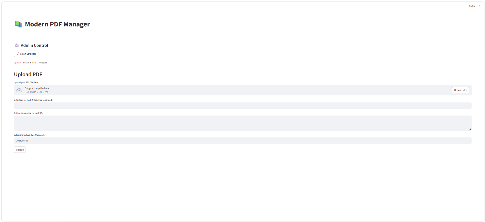
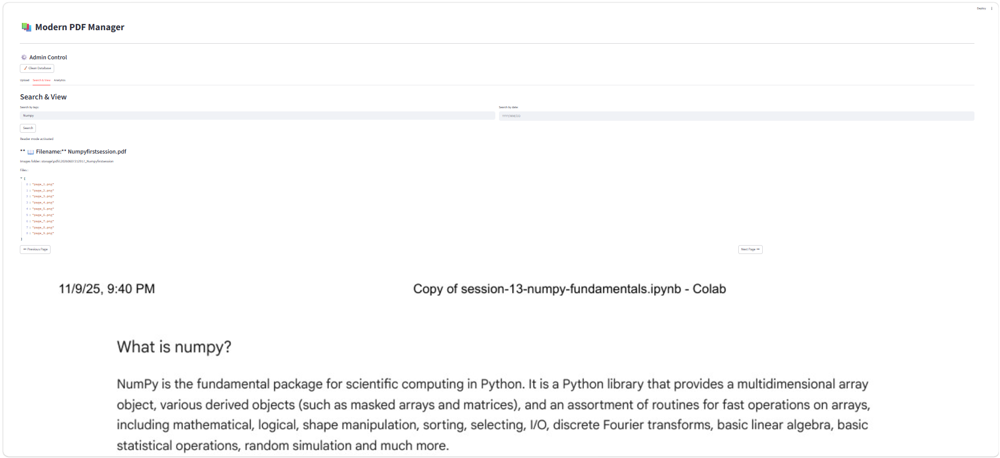
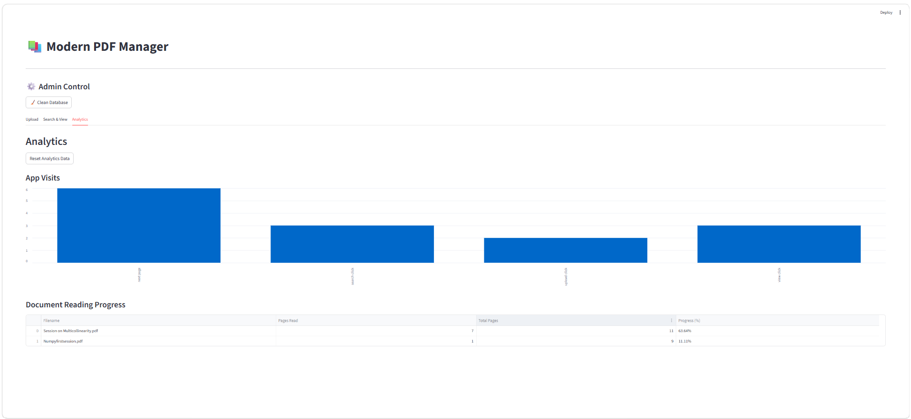

# PDF Manager & Analytics Dashboard

A modern document management application built with Streamlit that allows users to upload, organize, search, and read PDF documents while tracking reading progress through an integrated analytics dashboard.

## Features

### Document Management

* Upload PDF documents
* Store metadata including tags and descriptions
* Associate lecture dates with documents
* Organize documents using SQLite database

### PDF Processing

* Automatic thumbnail generation
* Convert PDF pages into images
* Fast page-by-page viewing experience
* Support for large PDF documents

### Search Functionality

* Search documents by tags
* Search documents by lecture date
* Quick access to stored documents

### PDF Reader

* Interactive page navigation
* Previous and next page controls
* Visual page rendering
* Reading progress tracking

### Analytics Dashboard

* Track application usage
* Monitor document reading activity
* Reading completion percentage
* Document engagement statistics

### Administration

* Password-protected reset functionality
* Database cleanup tools
* Storage management

## Screenshots

### Upload PDF

> 📸 Add a screenshot of the Upload tab here



---

### Search & View

> 📸 Add a screenshot showing search results and PDF reader



---

### Analytics Dashboard

> 📸 Add a screenshot of the analytics charts and reading progress


## Tech Stack

### Frontend

* Streamlit

### Backend

* Python

### Database

* SQLite

### Libraries

* Pandas
* PyMuPDF
* Pillow
* Python-dotenv

## Project Structure

pdf-manager/

├── App/

├── core/

│   ├── services.py

│   ├── reader.py

│   ├── thumbnail.py

│   ├── filemanager.py

│   └── analytics.py

├── db/

│   ├── database.py

│   └── repository.py

├── storage/

│   ├── pdfs/

│   └── thumbnail/

├── Data/

│   └── documents.db

├── assets/

│   ├── Upload.png

│   ├── Search_and_View.png

│   └── Analytics.png

├── .env.example

├── requirements.txt

└── README.md

## Installation

### Clone Repository

git clone https://github.com/s-a-n-d-ip/Document-Manager.git

cd pdf-manager

### Create Virtual Environment

python -m venv venv

### Activate Environment

Windows

venv\Scripts\activate

Linux/Mac

source venv/bin/activate

### Install Dependencies

pip install -r requirements.txt

## Environment Variables

Create a `.env` file in the project root:

```env
ADMIN_PASSWORD=your_password
```

A sample configuration is provided in `.env.example`.

### Run Application

streamlit run App/main.py

## Future Enhancements

* User authentication
* Role-based access control
* PDF summarization using LLMs
* Cloud storage integration
* OCR support
* Export analytics reports
* Deployment

## Author

Sandip Ghosh
